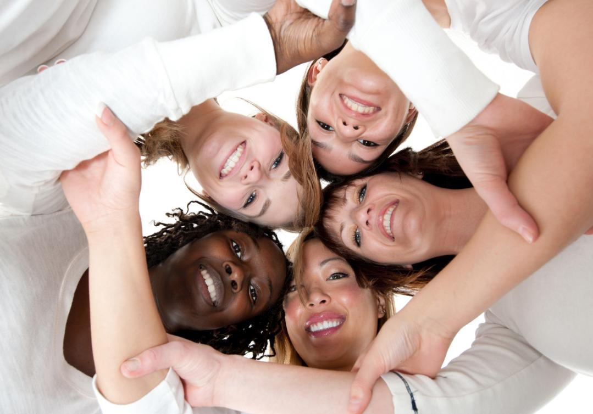

It seems obvious, doesn’t it? Of course we’re better together, offering one another support, finding greater resiliency, being in community. And yet there seem to be so many things keeping us apart. Covid. Racism. Politics. Schooling our kids from home. Scrambling to keep up with work. Scrambling to find work. Even, for many people, basic survival (think western fires, job loss, health issues, to name a few).

If we truly are better together, why are we trying to survive it all on our own?

Maybe it’s because some of us never saw “together” modeled. I didn’t. For many years growing up, my mother was a single working mom. I never saw women coming together to support each other. Yes, of course, my mom had a few girlfriends and they talked, I’m sure. But I never saw my mom receive support from other women. I never saw them gather together to help raise young children (e.g. helping to clean each other’s home together, helping support one another through shared childcare, sharing in meals, creating an experience of community). 

In fact, the messages I received included: Be independent. Rely on no one. Be “strong.”

If those are some of the things modeled and taught, it’s no wonder creating a sense of togetherness, or community, is such a challenge. It’s like we have some sense of it being true, but less experience of it being true.

I believe we really are better together--and we can build on that.

Together, there are more possibilities, more resiliency, more hope. And today, we need hope.

Today, we need each other.

So let’s start practicing “together.” Let’s explore what it means, how we create it, and where we can help it flourish.

Make no mistake. When we’re together, we can change...ourselves, our family, and our communities. 

Wondering how to get started? Remember a challenging time. Can you think of two things that would have helped you to feel more supported? They may have been small things. A hug would have reminded you that you weren’t alone. Or someone bringing a meal over. What are you facing today? Can you visualize receiving the support you just imagined? Who can you reach out to ask for support? Or, who can you reach out to and offer support?

If you’d like to learn more about my work, including exploring ways I can support you, email me at emelyn@emelynlybarger.com.

